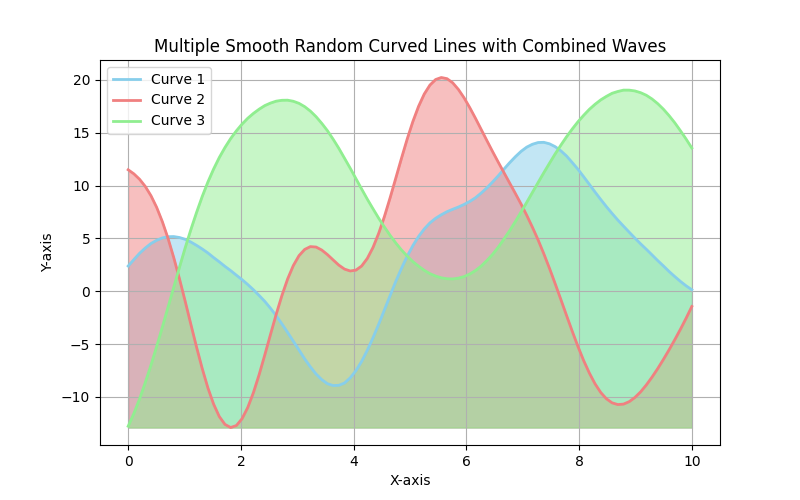
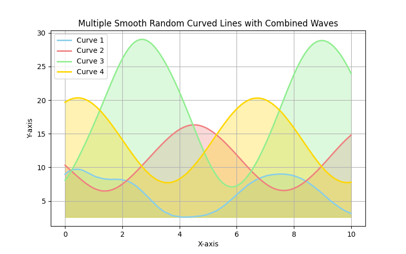
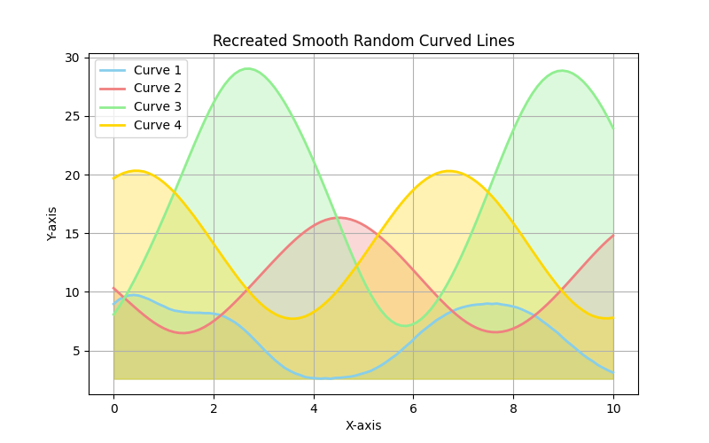
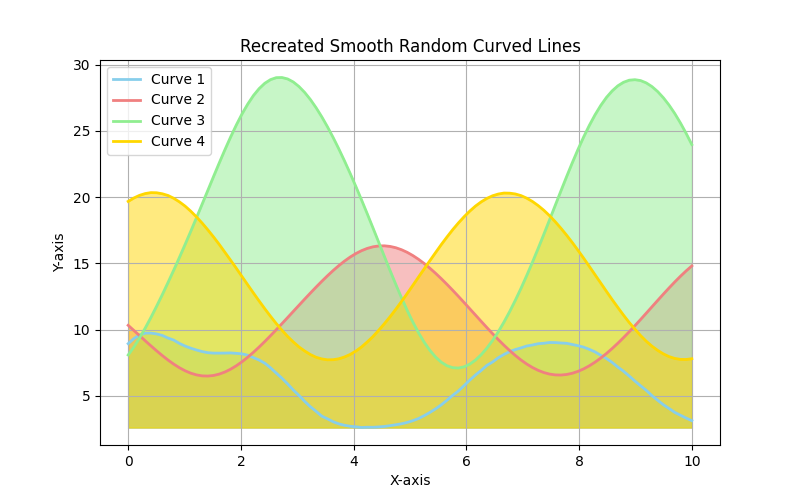
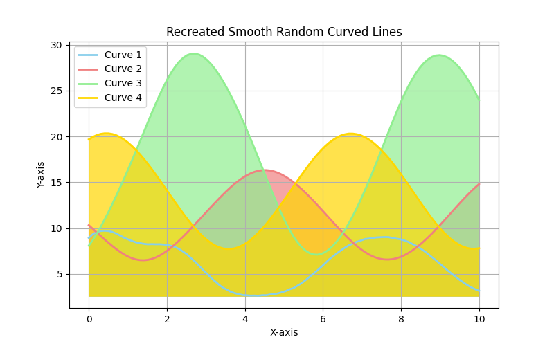

# OpacityTask 

This project generates **smooth random curved lines** using various mathematical waveforms (**sine, cosine, sinc, tanh, exponential**). It allows saving the generated plots and parameters to a JSON file for future re-creation.

## Features
- Generates multiple random curved lines with different wave combinations.
- Saves each plot as an image (`.png`) and stores parameters in a JSON file.
- Allows re-creating the exact same curves from the saved parameters.
- Allows configuring opacity for the shading of the curves.

